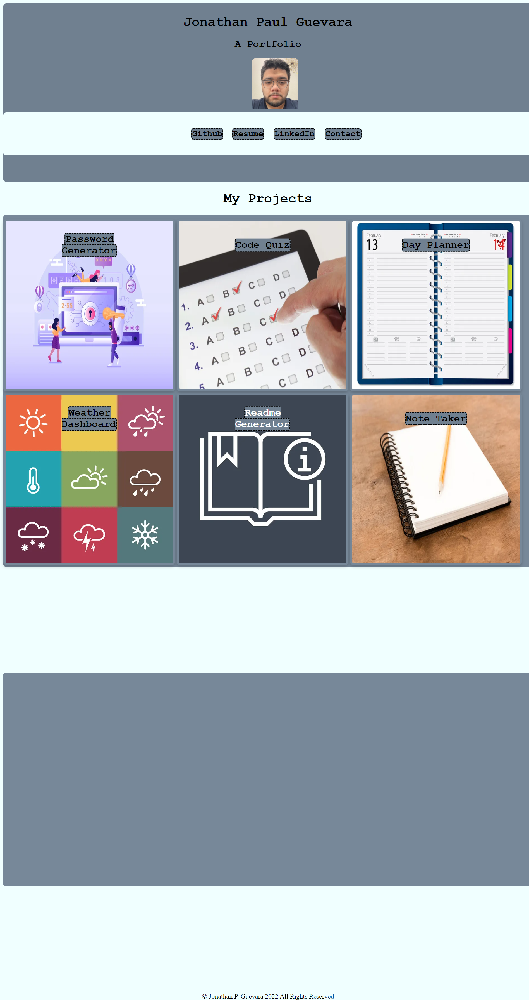

#Welcome to My Web Portfolio

Welcome to my porfolio!

Visible on the web-page are centered headers displaying my name
as well as a recent profile photo.

You will find four links under these: to my Github profile where
you can see the code for these projects (forthcoming). My updated resume
is accessible via the second link. My LinkedIn profile is linked to the third link.
Finally, using `mailto:` with my email address in the fourth link in the HTML code,
I've made the 'Contact' link allow for anyone to email me. Of course, my email address is also available on my resume.

Displayed in a grid and card format, I used the flex property among other things to show six projects which will be available to see in the future. For now, the titles on each card link to the homepage. You will see that upon hovering over each card, there is a white glow that complements the slate gray background.
In addition, you will notice that each link, upon hover, will have a white background. This white background uses a short transition animation for ease in.

Using a @media screen rule, the page is visible on most devices.

Here is a snapshot:

Thank you for stopping by!

-Jonathan
